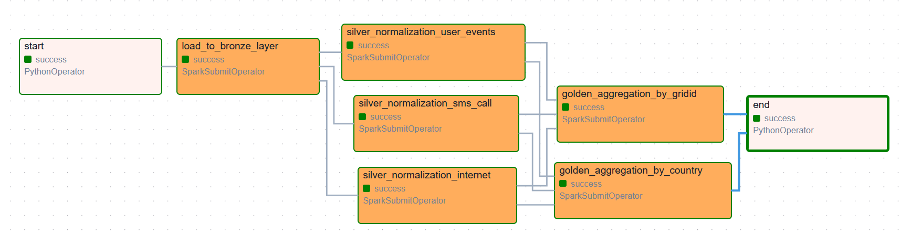
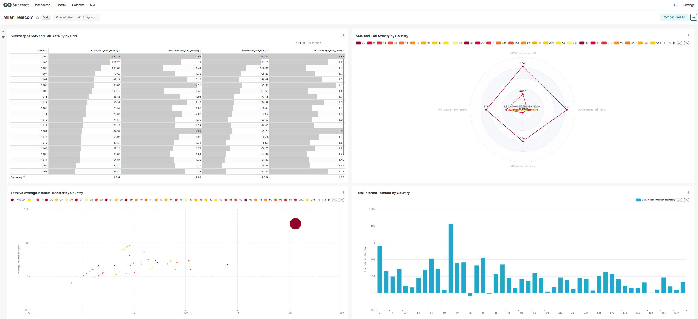

# **Telecom Data Pipeline Project**

This project demonstrates a data pipeline designed to process and analyze telecom data using Apache Airflow, Apache Spark, and Docker. The pipeline includes multiple layers of data transformation (bronze, silver, and gold) and supports scalable processing through Spark.

The pipeline processes telecom data from the [**Telecom Dataset**](https://www.kaggle.com/datasets/freckled/telecom), which contains details about SMS, calls, internet usage, and associated metadata. This dataset is used to perform ingestion, normalization, and aggregation tasks, showcasing end-to-end data processing for analytical purposes.

---

## **Features**

- **Bronze Layer**: Raw data ingestion from CSV files.
- **Silver Layer**: Data cleaning and normalization for specific use cases (internet, SMS & calls, user events).
- **Gold Layer**: Aggregated analytics based on `GridID` and `CountryCode`.
- **Containerized Execution**: Fully containerized using Docker Compose.
- **Workflow Management**: Apache Airflow DAG for task orchestration.
- **Scalable Processing**: Apache Spark for distributed data processing.

---

## **Pipeline Overview**

### **1. Bronze Layer**
- Ingests raw telecom data from a CSV file.
- Stores raw data in a structured directory (`/opt/data/bronze`).

### **2. Silver Layer**
- Cleans and transforms data into three normalized datasets:
  - **Internet Usage**: Extracts and filters internet traffic data.
  - **SMS and Call Data**: Computes SMS and call-related metrics.
  - **User Events**: Categorizes traffic type and calculates traffic amounts.
- Outputs data to `/opt/data/silver`.

### **3. Gold Layer**
- Performs aggregations for analytical insights:
  - **By GridID**: Aggregates data based on grid identifiers.
  - **By CountryCode**: Aggregates data based on country codes.
- Outputs data to `/opt/data/gold`.

---

## **DAG Workflow**

The data pipeline workflow is managed using Apache Airflow. Below is the Airflow DAG graph visualizing the pipeline:



1. **Start**: Initializes the pipeline.
2. **Bronze Layer**:
    - Ingests raw data from the CSV file.
3. **Silver Layer**:
    - Normalizes data for:
      - Internet Usage.
      - SMS and Call Data.
      - User Events.
4. **Gold Layer**:
    - Aggregates data:
      - By `GridID`.
      - By `CountryCode`.
5. **End**: Marks the pipeline as completed.

---

## **Modifications and Enhancements**

1. **Sinusoidal Function Generation**

A new feature was added to the pipeline: sinusoidal function generation. This function processes the aggregated data and computes a synthetic feature based on sinusoidal transformations. The purpose of this enhancement was to provide an additional analytical perspective and test the flexibility of the pipeline in handling non-linear transformations.


2. **Visualization Dashboard in Apache Superset**


To improve data analysis and presentation, a comprehensive dashboard was created in Apache Superset. The dashboard includes:

- **Summary of SMS and Call Activity by GridID**: A table presenting total and average values for SMS and call activities across different geographical areas.
- **Radar Chart**: Comparison of telecom activity (SMS, calls, and internet usage) across countries.
- **Scatter Plot**: Relationship between total and average internet transfer by country.
- **Bar Chart**: Total internet transfer by country.

## **Setup and Installation**

1. **Clone the Repository**
   ```bash
   git clone https://github.com/IvanFilipchuk/Milan_Telecom_AirFlow.git
   cd Milan_Telecom_AirFlow
   ```
2. **Download the dataset from Kaggle**  
   [**Telecom Dataset**](https://www.kaggle.com/datasets/freckled/telecom)

3. **Extract the dataset and move the file `data1.csv` to the `data` directory in the project**  
   ```plaintext
   Milan_Telecom_AirFlow/
   ├── data/
   │   └── data1.csv
   ```
4. **Build and set up the application using Docker Compose**
   ```bash
   docker-compose up --build
   ```

---
